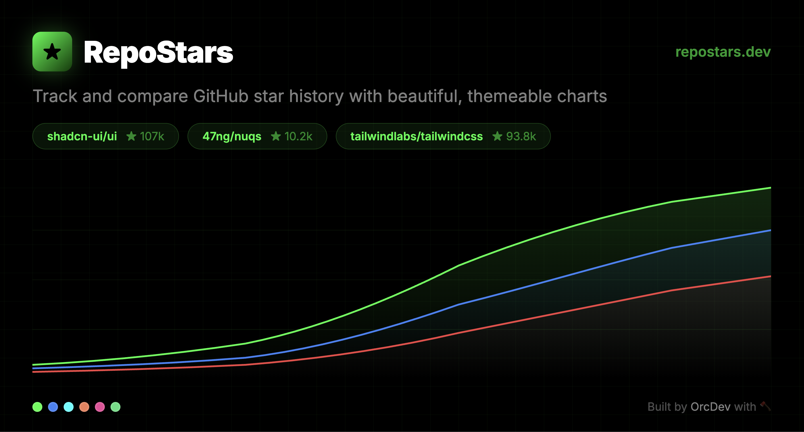

#  RepoStars

Modern, themeable GitHub star history charts. Track and compare repos with beautiful visualizations.



## Features

- **15 Themes** — Dark, Light, Neon, Minimal, 8-Bit, Sunset, Ocean, Candy, Forest, Terminal, Lava, Arctic, Copper, Synthwave, Sakura
- **Compare repos** — Up to 5 repos side-by-side on the same chart
- **Smart sampling** — Interpolated data with smart binning, fast even for repos with 200K+ stars
- **Shareable links** — URL params sync via nuqs — copy link with repos and theme baked in
- **Export PNG** — 2x resolution chart export
- **24h CDN cache** — Fast repeat loads, no unnecessary GitHub API calls

## Development

```bash
pnpm install
pnpm dev
```

Set `GITHUB_TOKEN` in `.env.local` for higher API rate limits (5,000/hr vs 60/hr).

## Tech Stack

- Next.js 16 (App Router)
- Tailwind CSS v4
- shadcn/ui
- Recharts
- nuqs (URL search params)
- GitHub REST API

## License

MIT
