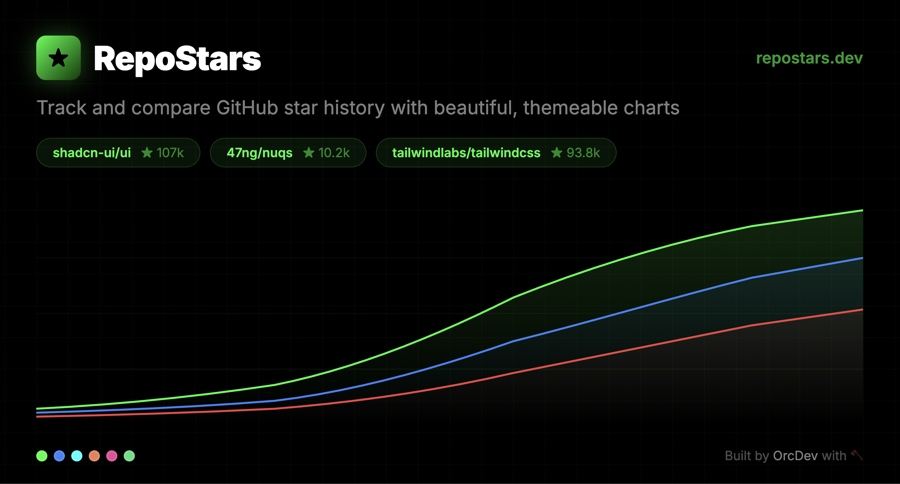

#  RepoStars

Modern, themeable GitHub star history charts. Track and compare repos with beautiful visualizations.



## Features

- **15 Themes** — Dark, Light, Neon, Minimal, 8-Bit, Sunset, Ocean, Candy, Forest, Terminal, Lava, Arctic, Copper, Synthwave, Sakura
- **Compare repos** — Up to 5 repos side-by-side on the same chart
- **Source-faithful rendering** — Keeps fetched stargazer timestamps and aggregate observations without inventing intermediate points
- **Graceful public fallback** — Shows exact public snapshot markers with dashed, explicitly unknown gaps when GitHub restricts stargazer timestamps
- **Shareable links** — URL params sync via nuqs — copy link with repos and theme baked in
- **Export PNG** — 2x resolution chart export
- **24h CDN cache** — Fast repeat loads, no unnecessary GitHub API calls

## Development

```bash
pnpm install
pnpm dev
```

Optionally set `GITHUB_TOKEN` in `.env.local`. GitHub only exposes stargazer timestamps for repositories the token owner administers or collaborates on. For other public repositories, RepoStars plots only exact aggregate observations available from public repository snapshots and archived GitHub metadata. Dashed gaps are unknown; RepoStars does not interpolate or scale them.

## Tech Stack

- Next.js 16 (App Router)
- Tailwind CSS v4
- shadcn/ui
- Recharts
- nuqs (URL search params)
- GitHub REST API
- ClickHouse public repository snapshots and archived GitHub metadata (observation-only fallback)

## License

MIT
